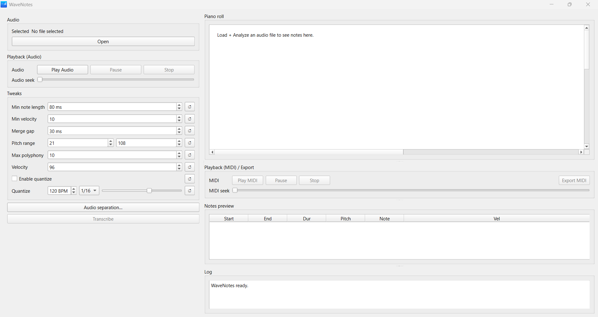
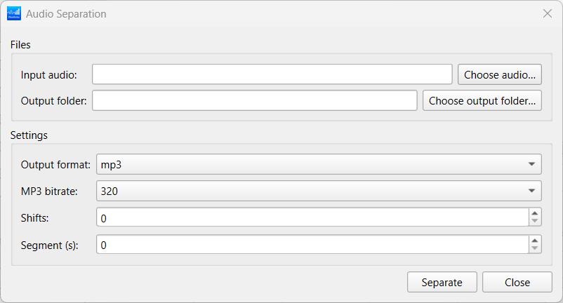

# 🎵 WaveNotes

WaveNotes is a desktop audio application that converts audio into MIDI notes and separates audio into instrument stems using modern machine-learning models.

It is designed for musicians, composers, game developers, animators, and audio creators who want powerful audio analysis tools in a simple desktop app.

---

## ✨ Features

### 🎼 Audio → MIDI

- Polyphonic pitch detection
- Converts audio into usable MIDI data
- Ideal for music composition and remixing

### 🎚️ Audio Separation

- Separate vocals, drums, bass, and other instruments
- Uses high-quality ML source separation
- Fully offline — models are bundled

### 🖥️ Desktop App

- Native Windows build
- No Python installation required for end users
- Clean and responsive UI

---

## 📸 Screenshots

### Main Window



### Audio Separation



## 🧠 Technologies Used

### Machine Learning

- **Basic Pitch** – audio-to-MIDI transcription  
- **Demucs (htdemucs_6s)** – music source separation  

### Frameworks & Libraries

- PySide6 (Qt)
- PyTorch (CPU)
- TensorFlow
- FFmpeg
- NumPy / SciPy
- Mido
- PyInstaller

---

## 📥 Downloads (End Users)

If you just want to use WaveNotes:

👉 Download the Windows build from **GitHub Releases**  
https://github.com/dumkene1/WaveNotes/releases

(No Python setup required.)

---

## 🔧 Development Setup (From Source)

### Requirements

- Python **3.11**
- Windows 10 / 11
- ffmpeg available in PATH

### Setup

```bash
git clone https://github.com/dumkene1/WaveNotes.git
cd WaveNotes
python -m venv .venv
.venv\Scripts\activate
pip install -r requirements.txt
python app/main.py
```
